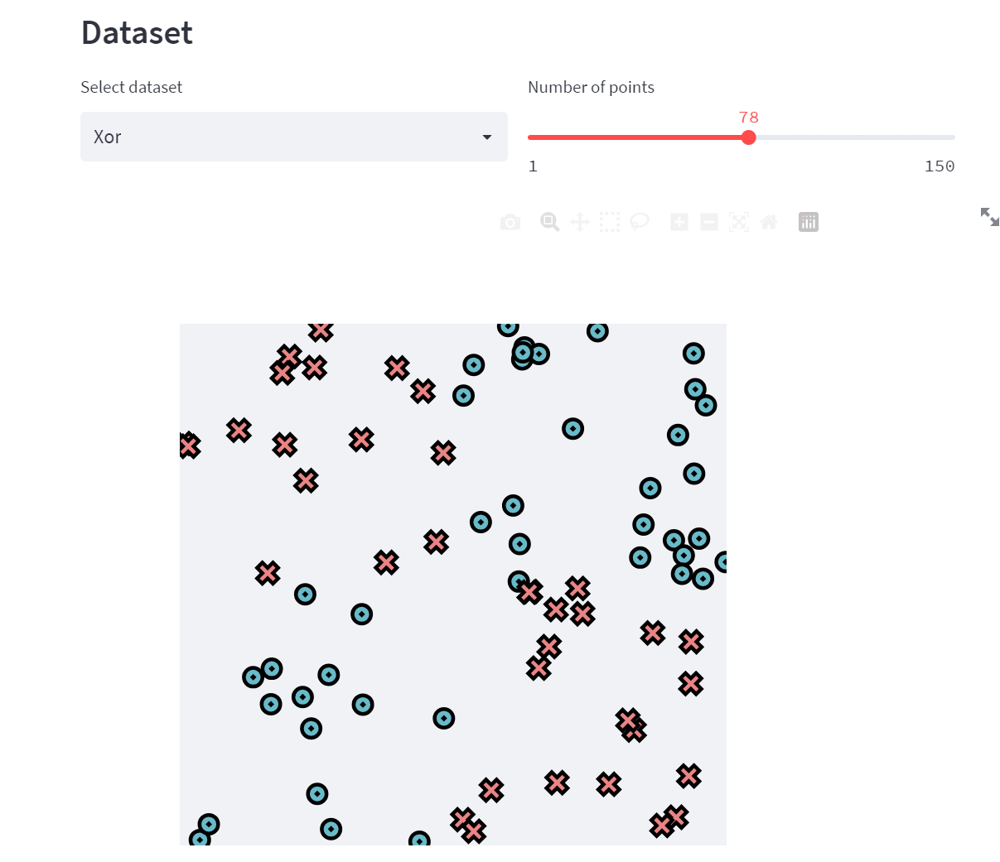
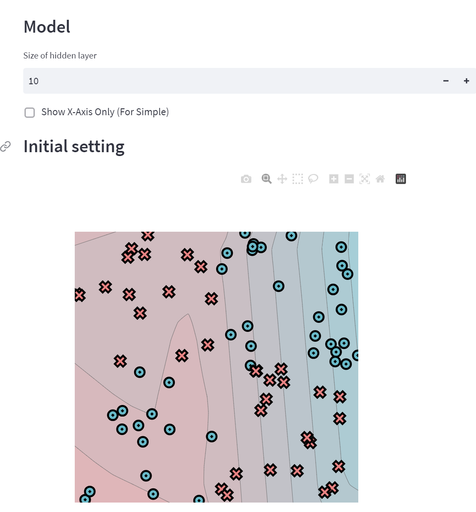
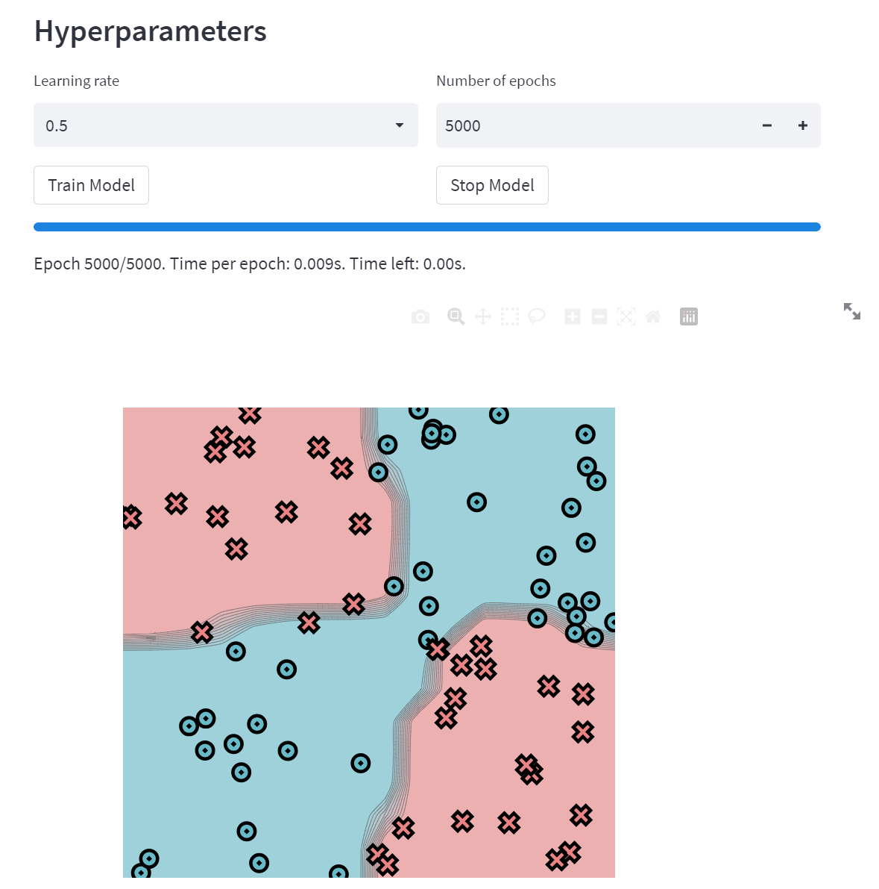
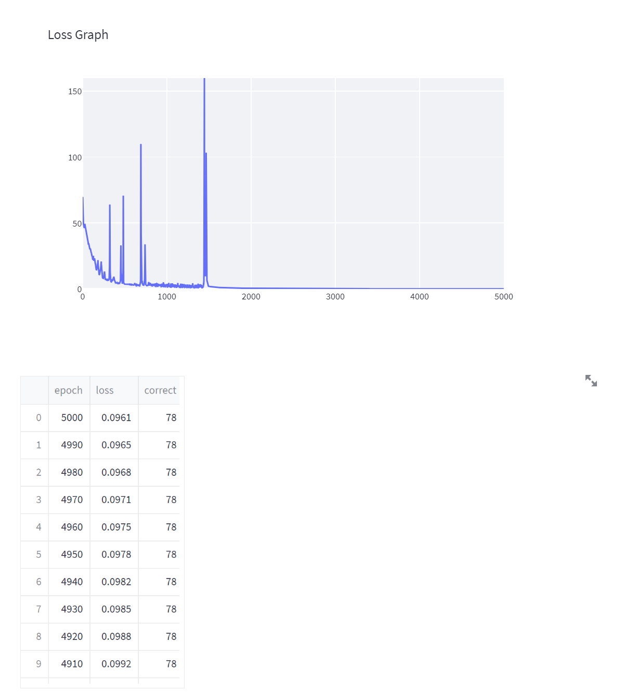
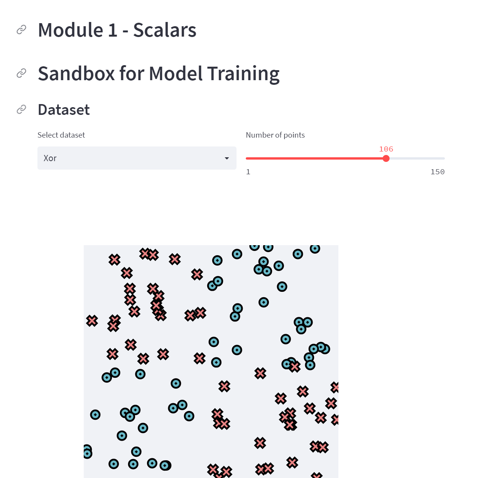
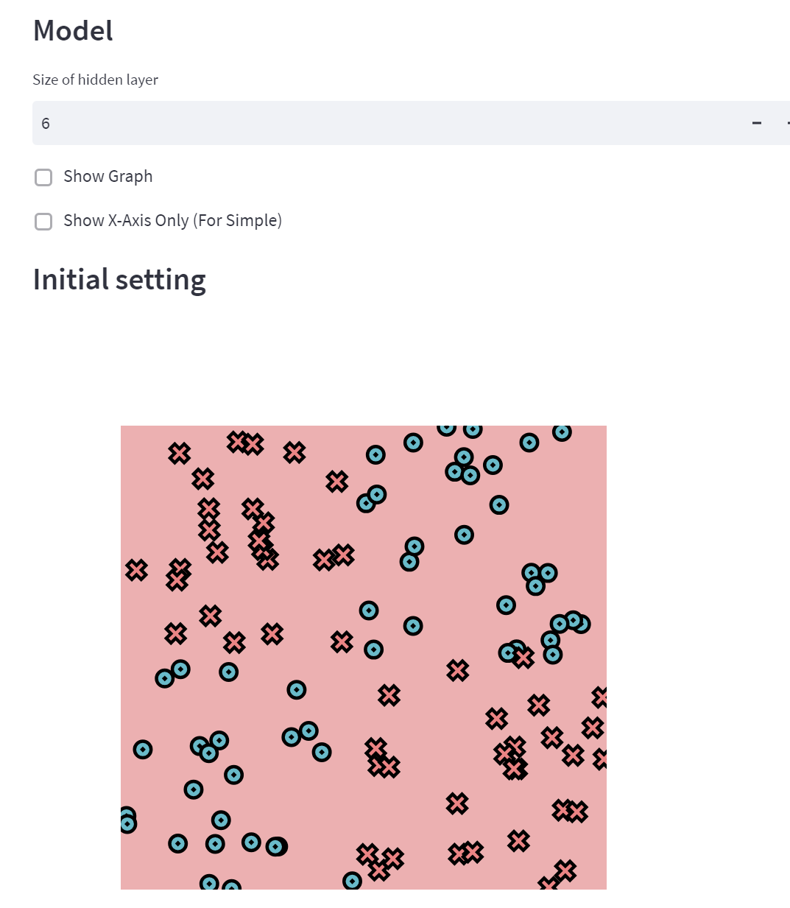
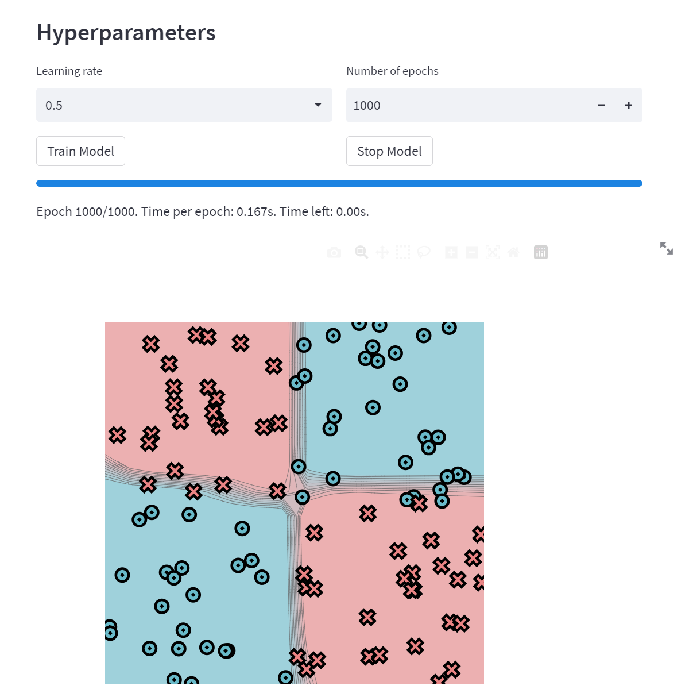

# MiniTorch
## Fundamental
### Task 0.5
Q: No module named 'altair.vegalite.v4'

A: You have installed the wrong version of altair, try reinstall altair with specific version, e.g., 
`pip install altair==4.0`

Q: "ModuleNotFoundError: No module named `xxx`" when run `streamlit run app.py -- 0` in Windows

A: This is due to the lack of python path, try `python -m streamlit run app.py -- 0` instead

DataSet:

Model:

HyperParameter(Note that the lr_rate is too large and can cause divergence but just save time):

Loss:

### Task 1.5

